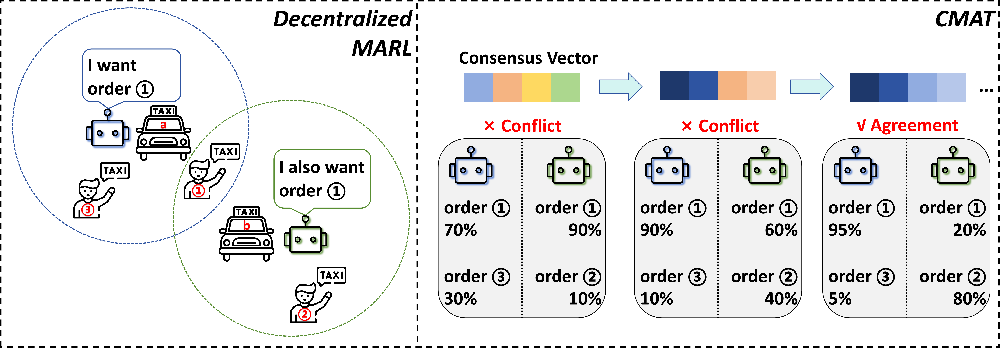
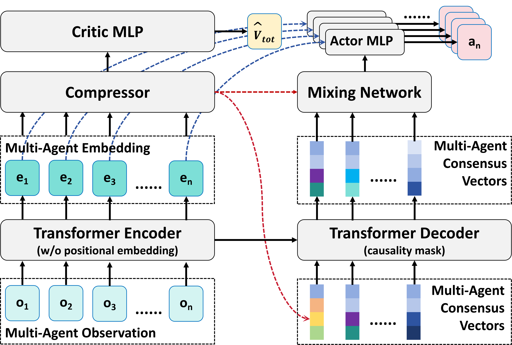

# CMAT
**Paper:** "Bridging MARL to SARL: Order-Independent Multi-Agent Transformer via Consensus Mechanism" (under review)


## 1. Workflow






## 2. How to Run

This implementation is based on the [PKU-MARL/Multi-Agent-Transformer](https://github.com/PKU-MARL/Multi-Agent-Transformer) repository. To set up CMAT: 

1. Add `cmat.py` and  `cmat_finetune.py` from this repository to the `./Multi-Agent-Transformer/mat/algorithms/mat/algorithm` directory. 
2. Replace the existing `mat_trainer.py` file in `./Multi-Agent-Transformer/mat/algorithms/mat` with the one from this repository.
3. Set the `--algorithm_name` parameter to `cmat`/`cmat_finetune` when running your experiments.


## 3. Citation

```

```

